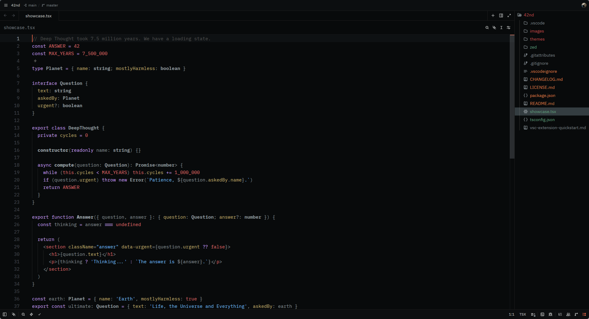
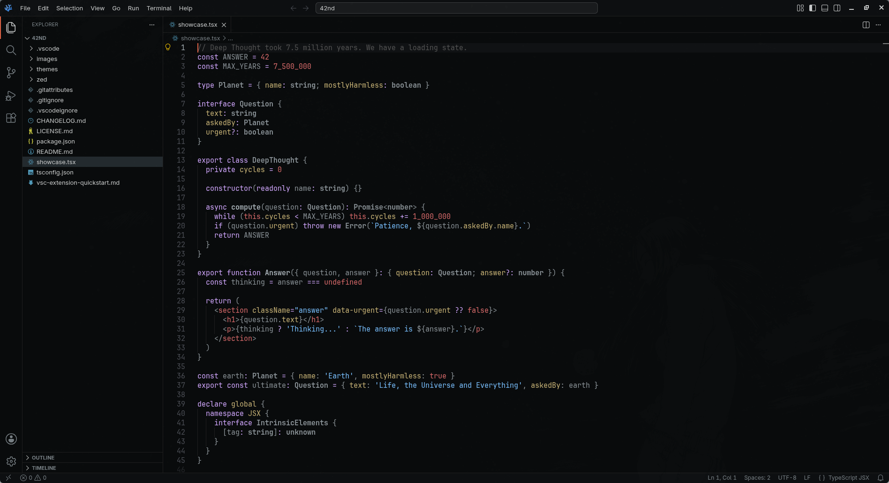
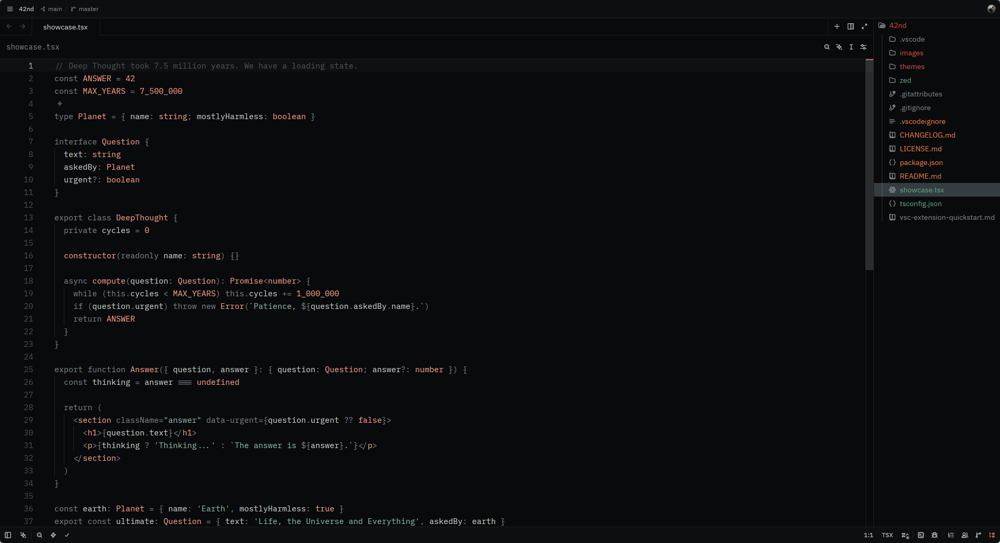
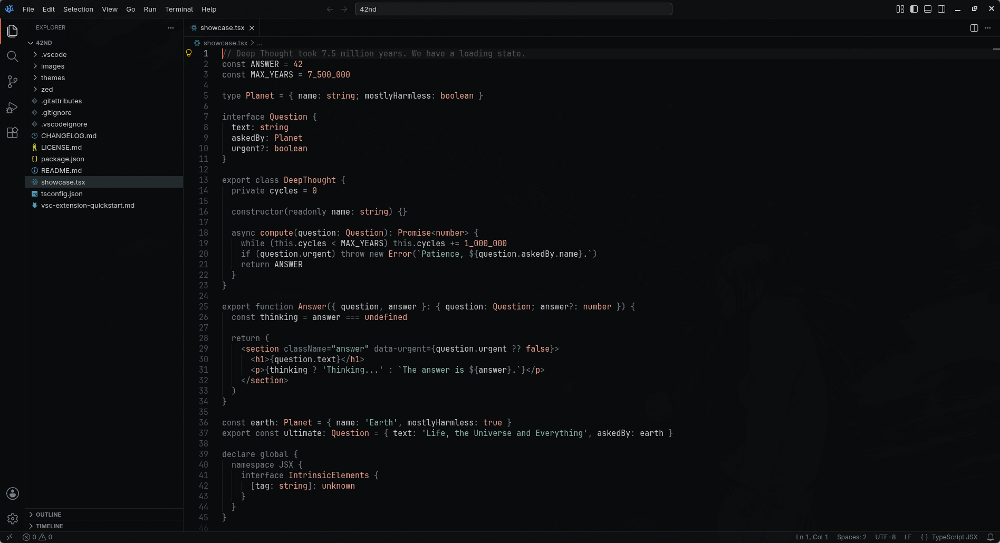

# 42nd

Dark, quiet themes for VS Code and Zed.
Near-black backgrounds and a slate UI borrowed from Solitude, with just enough color to read code fast.

- **42nd**: the original palette, with purple keywords, blue strings, gold properties and red tags.
- **42nd Ember**: almost monochrome, with a single ember accent for what matters.

## Screenshots

## Credits

- UI from [Solitude](https://omarchy.org), the Omarchy theme, through the Zed port by [Andres (SomeoneWithOptions)](https://github.com/SomeoneWithOptions/zed-solitude).
- 42nd Ember is inspired by [Vesper](https://github.com/raunofreiberg/vesper) by Rauno Freiberg and [Oscura](https://github.com/narative/oscura) by Narative - Fey.
