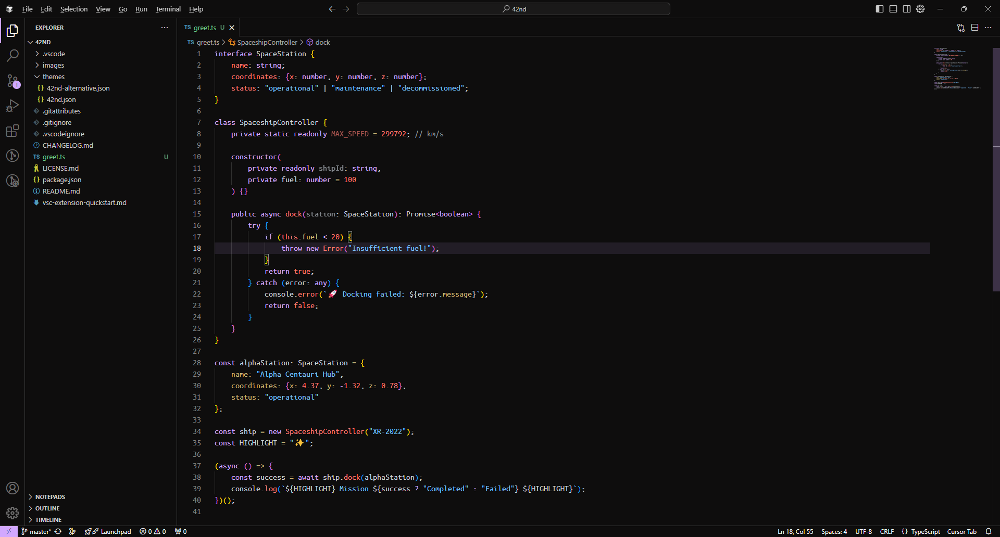

# 42nd Theme for VS Code

<span style="color: #cab577;">A sleek, minimalist dark theme designed to give your code editor a clean and modern look.</span> Perfect for developers who love a sharp contrast and a professional aesthetic.

## Screenshots

### Default Theme


### Alternative Theme


## Features

- <span style="color: #79C0FF;">**Dark Palette:**</span> A carefully curated dark background that reduces eye strain during long coding sessions. <span style="color: #79C0FF;">[WIP]</span>
- <span style="color: #FF7B72;">**Custom Syntax Highlighting:**</span> Beautiful, color-coded syntax highlighting tailored to improve code readability. <span style="color: #79C0FF;">[WIP]</span>
- <span style="color: #D2A8FF;">**Minimal Distraction:**</span> Simplistic UI with no unnecessary clutter. <span style="color: #79C0FF;">[WIP]</span>

## Installation

1. Open <span style="color: #79C0FF;">**Visual Studio Code**</span>.
2. Go to the Extensions view by clicking on the <span style="color: #cab577;">**Extensions icon**</span> in the Activity Bar on the side of the window.
3. Search for <span style="color: #79C0FF;">**42nd Theme**</span>.
4. Click <span style="color: #D2A8FF;">**Install**</span> to add it to your editor.
5. Go to <span style="color: #FF7B72;">**File > Preferences > Color Theme**</span>, and select <span style="color: #79C0FF;">**42nd**</span> from the list.

## Customization

If you want to tweak the theme to your preferences:

1. Open the <span style="color: #D2A8FF;">**Command Palette**</span> (`Ctrl+Shift+P` or `Cmd+Shift+P` on macOS).
2. Select <span style="color: #FF7B72;">**Preferences: Open Settings (JSON)**</span>.
3. Add or edit the desired settings to override the theme colors or token styles.

Example:

```json
"workbench.colorCustomizations": {
    "editor.background": "#0f0f0f",
    "editor.foreground": "#f4f4f4"
}
```

## Contributing

We welcome contributions from the community! If you'd like to help:

- Submit feature requests or bug reports through the [GitHub Issues](https://github.com/fawkes42/42nd/issues) page.
- Open a pull request with your changes. Please ensure they align with the theme's vision.

## License

This theme is licensed under the [MIT License](https://opensource.org/licenses/MIT).

## Credits

Created by **[fawkes42](https://github.com/fawkes42)**.

---

Enjoy coding with the <span style="color: #79C0FF;">**42nd Theme**</span>! Your feedback and support are greatly appreciated.
